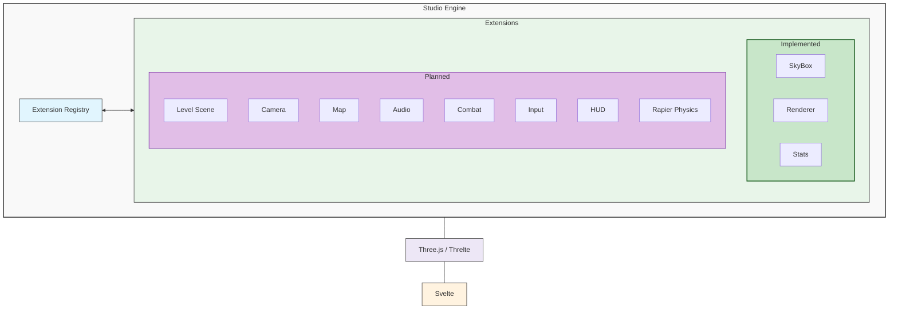
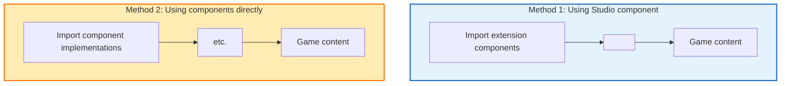
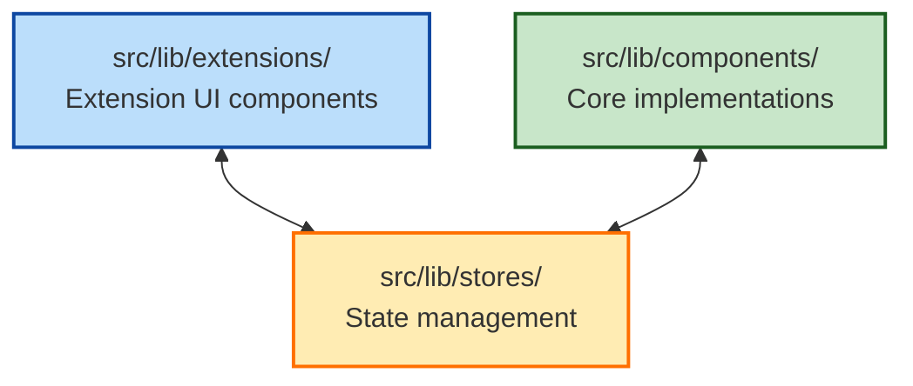
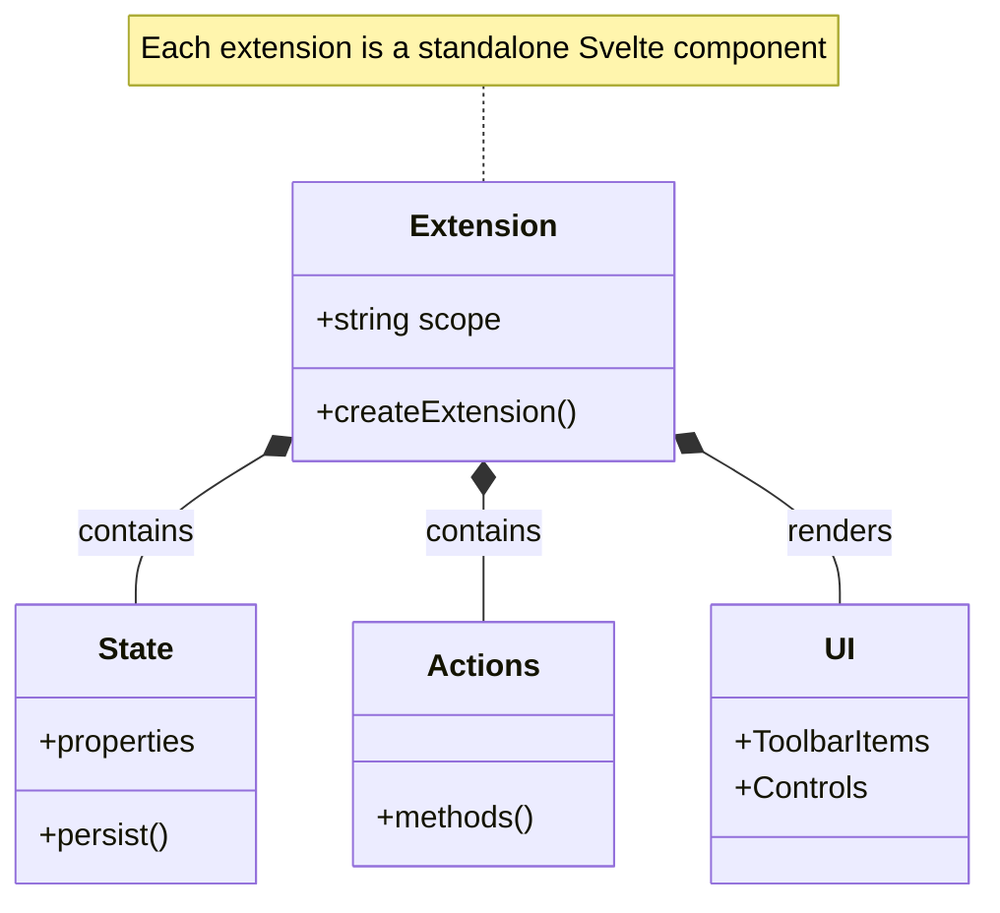
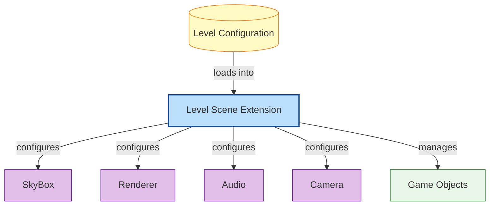

# Studio Engine Documentation

## Overview
This folder contains documentation for the Studio Engine, a modular, extensible framework for building 3D games with Svelte and Three.js using the Threlte library.

## Architecture

The [Studio Engine Architecture Plan](STUDIO_ENGINE.md) provides a comprehensive overview of the engine's design principles, core components, and implementation approach.



## Extensions

The Studio Engine is built around a modular extension system. Each extension handles a specific aspect of game development and can be enabled, disabled, or configured independently.

### Core Extensions

| Extension | Documentation | Implementation |
|-----------|---------------|----------------|
| 🌟 SkyBox | [EXT_SKYBOX.md](EXT_SKYBOX.md) | Implemented |
| 🎨 Renderer | [EXT_RENDERER.md](EXT_RENDERER.md) | Implemented |
| 📊 Stats | [EXT_STATS.md](EXT_STATS.md) | Implemented |
| 🎮 Level Scene | [EXT_SCENE.md](EXT_SCENE.md) | Planned |
| 📷 Camera | [EXT_CAMERA.md](EXT_CAMERA.md) | Planned |
| 🗺️ Map | [EXT_MAP.md](EXT_MAP.md) | Planned |
| 🔊 Audio | [EXT_AUDIO.md](EXT_AUDIO.md) | Planned |
| ⚔️ Combat | [EXT_COMBAT.md](EXT_COMBAT.md) | Planned |
| 📱 Input | [EXT_INPUT.md](EXT_INPUT.md) | Planned |
| 💻 HUD | [EXT_HUD.md](EXT_HUD.md) | Planned |
| 🧮 Rapier Physics | [EXT_RAPIER.md](EXT_RAPIER.md) | Planned |

## Using Extensions

There are two ways to use Studio Engine extensions:



### Method 1: Using the Studio component with extensions prop (Recommended)

```svelte
<script>
  import { Studio } from '@threlte/studio';
  import { Canvas } from '@threlte/core';
  
  // Import extensions
  import StatsExtension from '$lib/extensions/StatsExtension.svelte';
  import RendererExtension from '$lib/extensions/RendererExtension.svelte';
  import SkyBoxExtension from '$lib/extensions/SkyBoxExtension.svelte';
  
  // Custom game components
  import DemoScene from '$lib/demo/demoScene.svelte';
</script>

<Canvas>
  <Studio extensions={[StatsExtension, RendererExtension, SkyBoxExtension]}>
    <DemoScene />
  </Studio>
</Canvas>
```

### Method 2: Using extension components directly

This is an alternative approach as seen in App.svelte:

```svelte
<script>
  import { Canvas } from '@threlte/core';
  
  // Import components rather than extensions
  import SkyBox from '$lib/components/SkyBox.svelte';
  import Renderer from '$lib/components/Renderer.svelte';
  import DemoScene from '$lib/demo/demoScene.svelte';
</script>

<Canvas>
  <SkyBox />
  <Renderer />
  <DemoScene />
</Canvas>
```

## Creating New Extensions

To create a new extension:

1. Follow the [extension template](EXTENSION_TEMPLATE.md) to create documentation
2. Implement the extension following the pattern in existing extensions
3. Add documentation to this README

## Code Structure



The actual implementation of extensions can be found in:
- `/src/lib/extensions/` - Extension components (UI controls and configuration)
- `/src/lib/components/` - Core components (actual implementation)
- `/src/lib/stores/` - State stores for extensions

## Extension Architecture



All extensions follow a standard pattern:

```svelte
<script lang="ts">
  import { useStudio } from '@threlte/studio/extend';
  
  // Extension scope - must be unique
  const extensionScope = 'extension-name';
  
  // Create the extension
  const { createExtension } = useStudio();
  
  // Define the extension state and actions types
  type ExtensionState = {
    // State properties
  }
  
  type ExtensionActions = {
    // Action methods
  }
  
  const extension = createExtension<ExtensionState, ExtensionActions>({
    scope: extensionScope,
    state({ persist }) {
      return {
        // Your state here with persist() for values you want saved
      };
    },
    actions: {
      // Your actions here
    }
  });
</script>

<!-- Extension UI -->
<ToolbarItem position="left">
  <!-- Your controls here -->
</ToolbarItem>

<slot />
```

## Level Scene Integration



The Level Scene extension serves as a central manager for configuring all other extensions based on the current game level. Each level includes extension configurations that set appropriate values for that level.

See [EXT_SCENE.md](EXT_SCENE.md) for more details on how extensions are integrated through the level system.

## Future Development

Studio Engine is under active development. The roadmap includes:

1. Implementing all planned extensions
2. Creating a robust level editing system
3. Supporting game state and saving/loading
4. Providing additional example games
5. Improving performance and compatibility

## Contributing

To contribute to Studio Engine:

1. Follow the extension architecture pattern
2. Create documentation using the template
3. Ensure your code is well-tested and performant
4. Submit a pull request with your changes 