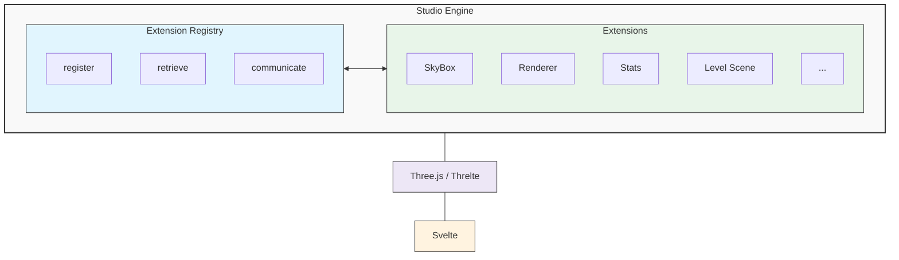
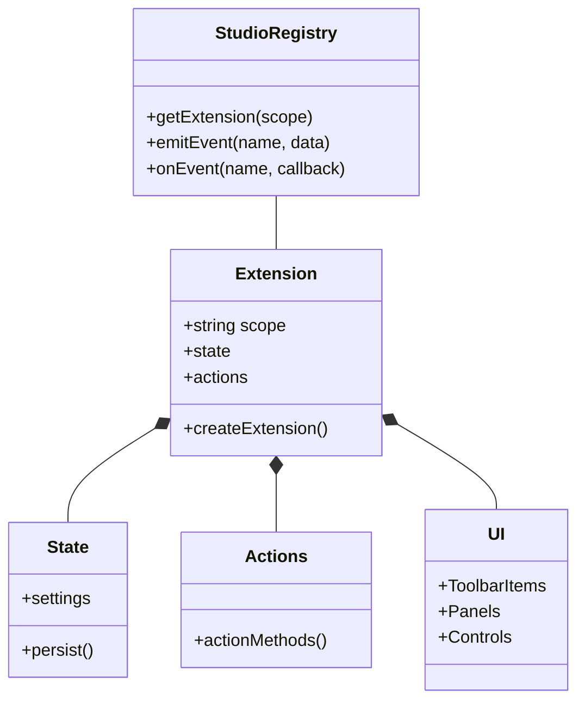
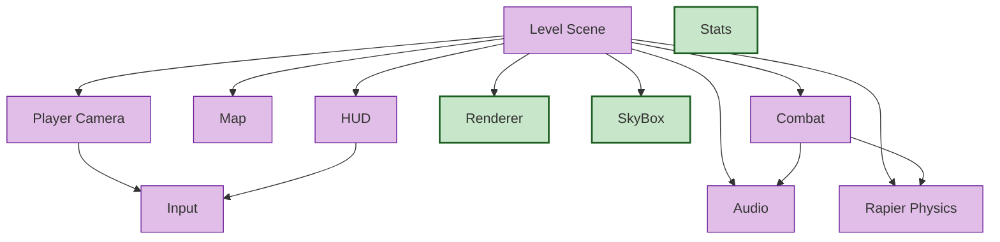
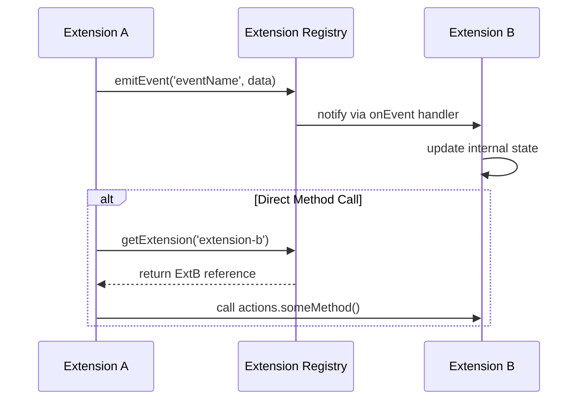
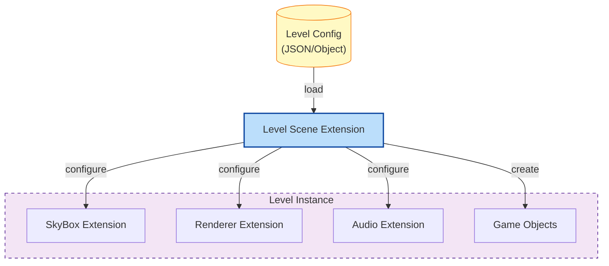
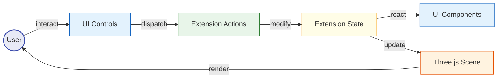

# Studio Engine Architecture Plan

## Overview
Studio Engine is a modular, extensible framework for building 3D games with Svelte and Three.js, using the Threlte library. It provides a set of core extensions that handle common game development tasks, allowing developers to quickly prototype and build games without reinventing fundamental systems.

The architecture follows a modular extension pattern, where each major subsystem is implemented as a self-contained extension with its own state management, UI components, and functionality.

## Core Principles
1. **Modularity**: Each extension is self-contained and can be enabled/disabled independently
2. **Configurability**: All aspects of the engine can be configured through UI panels or API
3. **Persistence**: Settings and configurations are persisted across sessions
4. **Performance**: Systems are optimized for performance in 3D environments
5. **Flexibility**: Support for different game types and genres
6. **Integration**: Extensions communicate with each other through a central registry

## Architecture Overview



## Extension System
The heart of Studio Engine is its extension system. Extensions are modular components that add specific functionality to the engine. Each extension follows a standard pattern:

```svelte
<script lang="ts">
  import { useStudio } from '@threlte/studio/extend';
  
  // Extension scope - must be unique
  const extensionScope = 'extension-name';
  
  // Create the extension
  const { createExtension } = useStudio();
  
  // Define the extension state and actions types
  type ExtensionState = {
    // State properties
  }
  
  type ExtensionActions = {
    // Action methods
  }
  
  const extension = createExtension<ExtensionState, ExtensionActions>({
    scope: extensionScope,
    state({ persist }) {
      return {
        // Persistent state with defaults
        setting1: persist('default-value'),
        setting2: persist(true),
        // ...
      };
    },
    actions: {
      // Methods that modify state or perform operations
      doSomething: (param) => {
        extension.state.setting1 = param;
      },
      // ...
    }
  });
</script>

<!-- Extension UI -->
<ToolbarItem position="left">
  <Panel title="Extension Name">
    <!-- Controls -->
  </Panel>
</ToolbarItem>

<!-- Content -->
<slot />
```

## Extension Architecture



## Core Extensions

### 1. Level Scene Extension
The Level Scene extension is the top-level manager that ties everything together. It allows configuring all other extensions for different game levels and manages transitions between levels.

**Key Features:**
- Level definitions with extension configurations
- Level switching with transitions
- Game object management
- Level progression tracking

### 2. Player Camera Extension
Handles player controls and camera movement, with configurable control schemes for different game types.

**Key Features:**
- Multiple control schemes (spacecraft, FPS, third-person)
- Physics-based movement
- Camera management
- Input handling

### 3. Map Extension
Manages the game world and terrain, including points of interest and environmental features.

**Key Features:**
- Multiple map types and configurations
- Dynamic map loading
- Points of interest management
- Map rotation and positioning

### 4. Audio Extension
Provides comprehensive audio management with spatial audio support, categories, and presets.

**Key Features:**
- Audio categories (music, sfx, ambience, voice, UI)
- Spatial audio for 3D environments
- Volume controls
- Audio presets

### 5. Combat Extension
Centralizes combat mechanics including projectiles, hit detection, and damage handling.

**Key Features:**
- Projectile management
- Hit detection
- Weapon systems
- Team/faction management

### 6. Renderer Extension (Implemented)
Controls rendering settings, post-processing effects, and performance optimizations.

**Key Features:**
- Post-processing effects toggle
- Bloom configuration (intensity, threshold, smoothing)
- Anti-aliasing (SMAA)
- Vignette effects
- Reset to defaults

### 7. Stats Extension (Implemented)
Provides performance monitoring and debugging tools.

**Key Features:**
- FPS counter
- Milliseconds per frame
- Memory usage
- Toggle visibility

### 8. SkyBox Extension (Implemented)
Manages the sky and environment lighting.

**Key Features:**
- Day/Night cycle configuration
- Sky atmospheric properties
- Star field appearance and layers
- Constellation settings
- Moon properties and positioning
- Reset to defaults

## Extension Relationships



## Extension Integration

Extensions communicate through the Extension Registry, which provides methods for:

1. **Registration**: Extensions register themselves with a unique scope
2. **Retrieval**: Components can retrieve extensions by scope
3. **Eventing**: Extensions can emit and listen for events
4. **State Access**: Authorized components can access and modify extension state

### Communication Example:

```typescript
// Extension A needs to notify Extension B about a change
const extensionA = useStudio().getExtension('extension-a');
const extensionB = useStudio().getExtension('extension-b');

// Direct method call
extensionB.actions.handleChange(newValue);

// Or through events
useStudio().emitEvent('objectSelected', { id: 'object-1' });

// Listening for events
useStudio().onEvent('objectSelected', (data) => {
  // Handle event
});
```

### Communication Flow



## Level System Integration

The Level Scene extension serves as a controller for all other extensions, configuring them based on the current level:

```typescript
// When loading a new level
function loadLevel(levelId) {
  // Get level configuration
  const levelConfig = levels[levelId];
  
  // Configure each extension
  Object.entries(levelConfig.extensions).forEach(([extName, config]) => {
    const extension = useStudio().getExtension(extName);
    if (extension) {
      // Apply configuration
      Object.entries(config).forEach(([key, value]) => {
        if (extension.actions.updateSetting) {
          extension.actions.updateSetting(key, value);
        } else {
          extension.state[key] = value;
        }
      });
    }
  });
  
  // Load game objects
  levelConfig.gameObjects.forEach(obj => {
    // Create game objects in the scene
  });
}
```

### Level System Flow



## Data Flow

The data flow in Studio Engine follows this pattern:

1. **User Interaction**: User interacts with UI or game
2. **Action Dispatch**: Actions are dispatched to the appropriate extension
3. **State Update**: Extension updates its internal state
4. **UI Update**: UI components react to state changes
5. **Scene Update**: Three.js/Threlte scene updates based on state



## Implementation Steps

### 1. Core Framework
- Set up Threlte and Three.js integration
- Implement extension registry
- Create base extension patterns
- Establish communication protocols

### 2. Individual Extensions
- Implement each core extension
- Design and implement extension UIs
- Create extension-specific components
- Establish extension tests

### 3. Integration
- Implement communication between extensions
- Create level management system
- Integrate extensions with level system
- Develop demo showcasing extension integration

### 4. Optimization
- Performance profiling
- Memory management
- Rendering optimizations
- Load time improvements

### 5. Documentation
- API documentation
- Usage examples
- Extension development guide
- Performance best practices

## Usage Example

There are two ways to use Studio Engine extensions:

### Method 1: Using the Studio component with extensions prop (Recommended)

```svelte
<script>
  import { Studio } from '@threlte/studio';
  import { Canvas } from '@threlte/core';
  
  // Import extensions
  import StatsExtension from '$lib/extensions/StatsExtension.svelte';
  import RendererExtension from '$lib/extensions/RendererExtension.svelte';
  import SkyBoxExtension from '$lib/extensions/SkyBoxExtension.svelte';
  
  // Custom game components
  import DemoScene from '$lib/demo/demoScene.svelte';
</script>

<Canvas>
  <Studio extensions={[StatsExtension, RendererExtension, SkyBoxExtension]}>
    <DemoScene />
  </Studio>
</Canvas>
```

### Method 2: Using extension components directly

```svelte
<script>
  import { Canvas } from '@threlte/core';
  
  // Import components
  import SkyBox from '$lib/components/SkyBox.svelte';
  import Renderer from '$lib/components/Renderer.svelte';
  import DemoScene from '$lib/demo/demoScene.svelte';
</script>

<Canvas>
  <SkyBox />
  <Renderer />
  <DemoScene />
</Canvas>
```

## Extension Development

To create a new extension, developers follow these steps:

1. Create an extension component using the extension pattern
2. Define the extension state and persistence needs
3. Implement actions for state manipulation
4. Create UI components for the extension
5. Register the extension with the Studio Engine
6. Implement integration with other extensions as needed
7. Create documentation following the extension template

## Future Extensions

Potential future extensions include:

1. **Rapier Physics Extension**: Advanced physics simulation
2. **Input Extension**: Advanced input handling and mapping
3. **HUD Extension**: Heads-up display and UI overlays
4. **Inventory Extension**: Item and inventory systems
5. **Quest Extension**: Mission and objective tracking
6. **Save System Extension**: Game saving and loading
7. **Weather Extension**: Dynamic weather effects
8. **Dialogue Extension**: Character dialogue systems

## Conclusion

Studio Engine provides a comprehensive framework for building 3D games with Svelte and Three.js (Threlte). Its modular extension architecture allows for flexibility and customization while providing the core functionality needed for game development. By separating concerns into focused extensions, it enables developers to build complex games without becoming overwhelmed by interdependent systems. 